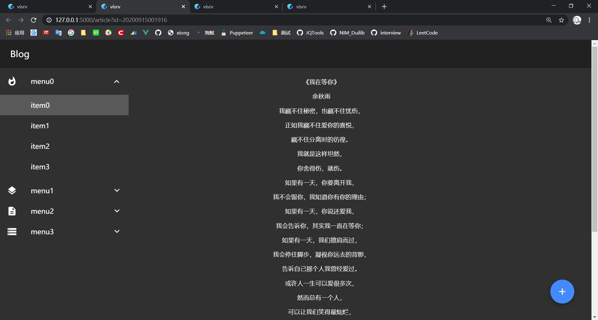

# 介绍
这是一个前后端分离的博客系统
支持WangEditor富文本编辑器；  
支持上传PDF文档。  
UI采用Material Design作为基本风格，简洁与质感并存。
使用python开发的web后台，数据存储于本地的redis仓库。  

Flask框架参考文档：  
https://dormousehole.readthedocs.io/en/latest/   

vue.js框架参考文档：  
https://cn.vuejs.org/

Vue Material框架参考文档：  
https://vuematerial.io/

# 预览

